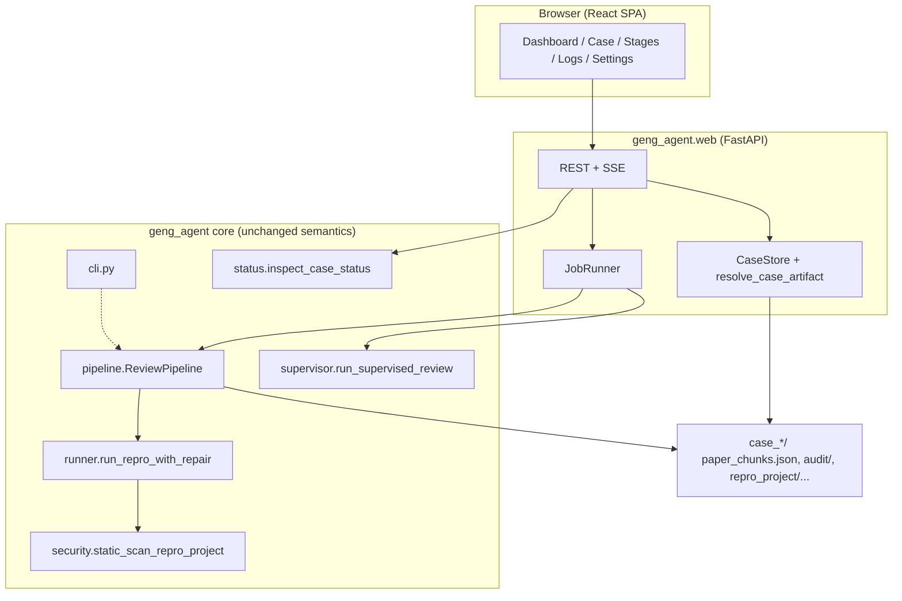
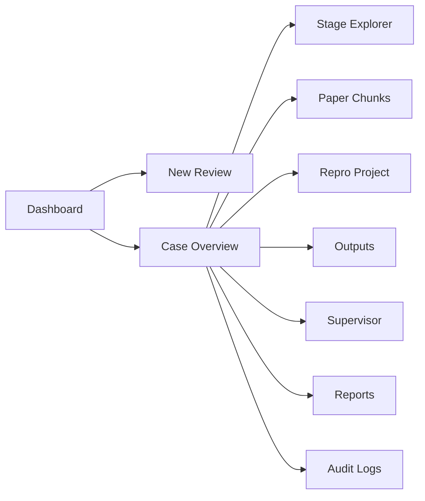

# 耿同学agent Web UI — Design Document

| Field | Value |
|-------|-------|
| **Status** | Draft (review addressed 2026-06-05; UX: 简约中文 v1) |
| **Author** | Systems design (grok) |
| **Date** | 2026-06-05 |
| **Repo** | `C:\Users\84475\Documents\耿同学agent` |
| **Package** | `geng_agent` v0.1.0 |

---

## Overview

This document specifies an **interactive web application** for **耿同学agent** (`geng-agent`): a local CLI that performs communication-paper **engineering reproducibility review**. The web UI makes the existing pipeline (`review`, `supervise`, `status`) usable without relying solely on terminal commands, while preserving the security model (guarded runner, dependency whitelist, static scan) and the product boundary (**reproducibility risk**, not fraud verdict).

**Recommended shape:** a **local-first** stack with a **FastAPI** backend that **imports** `ReviewPipeline` / `run_supervised_review` / `inspect_case_status`, plus a **React + TypeScript** SPA for multi-stage progress, artifact browsing, and visualizations. Long-running LLM work runs in a **background job runner** with **SSE** (and polling fallback) for progress.

**UX (user-confirmed):** v1 UI is **简约** (minimal chrome, low visual noise) and **简体中文-only** for all user-visible copy. API field names and `status.STAGES` ids stay English in code/JSON; the frontend maps them to Chinese labels.



---

## Background & Motivation

### What exists today

| Component | Path | Role |
|-----------|------|------|
| CLI entry | `geng_agent/cli.py` | `review`, `supervise`, `status`; builds `OpenAICompatibleClient` from `GENG_LLM_*` env (incl. Windows registry) |
| Pipeline | `geng_agent/pipeline.py` | PDF/TXT/MD → facts → tasks → manifest → `repro_project/` → optional guarded run → result review → `review.md` / `risk_report.json` |
| Supervisor | `geng_agent/supervisor.py` | LangGraph loop: inspect → evidence → reflect → act; writes `reflections/step_*.json` |
| Status | `geng_agent/status.py` | `STAGES` list, `inspect_case_status()`, suggested resume command |
| Path helper | `geng_agent/outputs.py` | `resolve_inside(root, rel)` — **strips `repro_project/` prefix** before join; correct when `root == repro_project_dir`, **not** when `root == case_dir` |
| Security | `geng_agent/security.py`, `geng_agent/runner.py` | Whitelist deps, AST scan, `build_safe_env`, subprocess run inside project only |
| Schemas | `geng_agent/schema_models.py`, `schemas/*.json` | Pydantic truth source |
| Sample cases | e.g. `case_rayleigh_2406_001/` at **repo root** | Rich artifacts: `risk_report.json`, `audit/`, `repro_project/outputs/*.csv`, `reflections/` |

The README documents the workflow and output tree. There is **no web layer** today (no FastAPI/Streamlit/Gradio in repo).

### Pain points the UI solves

1. **Opaque long runs** — project generation can use `--project-timeout 1200`; users need stage-level visibility, not a silent terminal.
2. **Artifact sprawl** — cases contain JSON, Markdown, DOCX, CSV, PNG, repair logs; CLI `status` JSON is correct but not navigable.
3. **Supervisor loop** — `reflections/` and `supervisor_decision.schema.json` actions (`retry_stage`, `ask_human`, etc.) need a timeline UI.
4. **Windows-primary users** — PowerShell env setup (`GENG_LLM_*`) and path quoting are friction; a settings page + file upload lowers the bar.

### Product constraints (from README + code)

- **UNTRUSTED DATA** — paper text, logs, stderr, code snippets must not be executed as instructions in the UI (sanitize display, no `dangerouslySetInnerHTML` on audit/raw LLM output without escaping).
- **Default: no auto-run** — `run_repro` defaults `False` in CLI; web must require explicit opt-in (checkbox + confirmation) and **server-side enforcement** when feature flag is off.
- **No fraud verdict** — surface `risk_report.json` / `reproducibility_verdict`; never label “造假”.
- **Multimodal result review** — README: requires OpenAI-compatible `image_url`; otherwise `result_review_error.json` is written (no text fallback). UI must warn when enabling result review without multimodal support.

---

## Goals & Non-Goals

### Goals

| ID | Goal |
|----|------|
| G1 | Start **review** and **supervise** runs from browser with **CLI parity** (all `_add_common_review_args` + `SuperviseOptions` fields, tiered UI) |
| G2 | Show **pipeline stage status** aligned with `status.STAGES`, including **in-progress** during active runs |
| G3 | Browse **audit trail**, **risk report**, **repro outputs**, **reflections**, **repair_logs** |
| G4 | Support **long-running jobs** with cancel-safe progress (SSE + polling); cooperative cancel at stage boundaries |
| G5 | **Windows-friendly** local deploy (`127.0.0.1`, single command to start) |
| G6 | **Minimal core changes** — import `ReviewPipeline`, do not shell out to CLI for normal operation |
| G7 | Respect **guarded execution** — web never runs repro code outside `runner.run_repro_with_repair`; preflight scan before `--run-repro` |
| G8 | **简体中文** interface with **简约** visual design (see §3.1) |

### Non-Goals (v1)

| ID | Non-Goal |
|----|----------|
| NG1 | Multi-tenant SaaS or cloud case storage |
| NG2 | Replacing scientific judgment or automating publication decisions |
| NG3 | Editing/generated repro code in-browser with arbitrary execution |
| NG4 | Bypassing `security.py` scans or running user-uploaded `.py` outside case `repro_project/` |
| NG5 | Full OpenHands IDE embedding (surface logs only) |
| NG6 | **i18n / English UI** in v1 (no locale switcher; strings live in one zh-CN catalog) |

---

## Proposed Design

### 1. Information Architecture

| View (UI 标题) | Route | Primary data sources |
|----------------|-------|----------------------|
| **案例列表** | `/` | Scan cases root; summary from `inspect_case_status` + **cases root path** + empty-state help |
| **新建审查** | `/cases/new` | Upload PDF/TXT/MD; form uses **CLI parity matrix** tiers (basic/advanced) |
| **案例概览** | `/cases/:caseId` | Stage stepper (`active_run` + status + SSE), verdict card |
| **阶段详情** | `/cases/:caseId/stages/:stage` | Stage JSON + **STAGE_AUDIT_MAP** audit files |
| **论文片段** | `/cases/:caseId/paper` | `paper_chunks.json` with chunk_id search |
| **复现项目** | `/cases/:caseId/repro` | File tree under `repro_project/`; read-only code viewer |
| **输出与图表** | `/cases/:caseId/outputs` | `repro_project/outputs/*.csv`, `*.png` via artifact API |
| **运行与修复** | `/cases/:caseId/runtime` | `runtime_result.json`, `repair_logs/*.json` |
| **监督调度** | `/cases/:caseId/supervisor` | `reflections/step_*.json`, `final_reflection.json` |
| **审查报告** | `/cases/:caseId/reports` | `review.md`, `result_review.md`; multimodal warning banner |
| **审计日志** | `/cases/:caseId/audit` | `audit/*` full-text with JSON side panel |
| **设置** | `/settings` | LLM config (masked), cases root, capabilities (`multimodal_supported`, `openhands_available`) |



#### Case identity & cases root

| Setting | Default | Notes |
|---------|---------|-------|
| `GENG_CASES_ROOT` | `%USERPROFILE%\Documents\geng_cases` on Windows | Production default for new cases |
| **Dev / alpha** | Point at repo: `C:\Users\84475\Documents\耿同学agent` | Repo already contains `case_rayleigh_2406_001`, `case_wimax_*`, etc. |

**First-run (document in README + Dashboard empty state):**

```powershell
$env:GENG_CASES_ROOT="C:\Users\84475\Documents\耿同学agent"
python -m geng_agent.web
```

Dashboard shows **current cases root** and, when empty, instructions to set `GENG_CASES_ROOT` or create a case via **New review**.

**Case identity:** `caseId` = directory name under cases root. Upload creates `case_<slug>_<shortid>/` with canonical paper under `paper/<filename>`.

#### Paper path for pipeline runs (critical for resume)

`ReviewPipeline.run(paper_path=...)` and `_paper_cache_matches` require `paper_chunks.json` `source_path` to **resolve equal** to the `paper_path` passed on each run (`pipeline.py` lines 1033–1041).

**On `POST /cases` (upload):**

1. Write bytes to `{case_dir}/paper/{original_filename}`.
2. Set `.geng/meta.json`:

```json
{
  "display_name": "...",
  "created_at": "...",
  "paper_filename": "paper.pdf",
  "paper_path": "paper/paper.pdf"
}
```

3. On **first** pipeline run, pass `paper_path = case_dir / meta.paper_path` (resolved). Pipeline writes `paper_chunks.json` with `source_path` set to that **absolute resolved path** of the stored copy (not the user’s original Downloads path).

**On `POST /cases/{caseId}/runs` (JobRunner resolution order):**

| Priority | Source | Use when |
|----------|--------|----------|
| 1 | `.geng/meta.json` → `paper_path` | Upload/web-created case |
| 2 | `paper_chunks.json` → `source_path` | Legacy CLI case **only if** file exists on disk |
| 3 | `paper/*` (single file) | Recovery if meta missing |
| — | Fail `400` | No resolvable paper; UI shows “re-upload paper” |

**Never** pass a moved/deleted original CLI path if `paper/` copy exists. Optional migration tool (v2): rewrite `source_path` in `paper_chunks.json` to case-local copy.

---

### 2. Backend Architecture

#### 2.1 Stack

| Layer | Choice | Rationale |
|-------|--------|-----------|
| HTTP API | **FastAPI** | Native async, SSE, Pydantic; CORS for Vite dev |
| Job execution | **Thread pool** (`asyncio.to_thread` wrapper) | `OpenAICompatibleClient` uses **sync** `urllib` (`llm.py`); blocking calls must not run on event loop |
| Concurrency | **Default N=1** (Windows), max queue depth **2** | Matches OQ4; two concurrent 1200s project LLM calls exhaust RAM/API on 8GB laptops |
| Progress | **SSE** + `events.jsonl` + **`active_run` in status** | Stepper needs run metadata, not only `inspect_case_status` |
| Static UI | `geng_agent/web/static/` + SPA fallback | Production single command |

**Not recommended:** subprocess CLI as primary path; `outputs.resolve_inside(case_dir, …)` for all artifacts (see §2.5).

#### 2.2 Package layout (new)

```text
geng_agent/
  web/
    app.py
    config.py
    jobs.py
    events.py
    routes/
    services/
      case_store.py
      artifact_io.py      # resolve_case_artifact (NOT bare resolve_inside on case_dir)
      llm_factory.py
      paper_path.py       # resolve_paper_path(case_dir)
      stage_audit_map.py  # STAGE_AUDIT_MAP helper
  progress.py             # PipelineListener + CancelToken
  config.py               # shared env (from cli)
```

#### 2.3 Job model & CLI parity

**Lifecycle:** `queued` → `running` → `succeeded` | `failed` | `cancelled`. Persist `.geng/runs/{run_id}.json`.

**Preflight (`POST /runs`):** Before enqueue:

- `GENG_LLM_API_KEY` and `GENG_LLM_MODEL` present (same rules as `cli._build_client_or_error`) → else `422` with message.
- Per-case lock → else `409`.
- Global queue depth ≥ max → `503` with “single active run” copy.
- If `run_repro: true` and `GENG_WEB_ENABLE_RUN_REPRO` unset/false → **`403`** (server enforcement, not UI-only).
- If `repair_backend` is `openhands` or `hybrid` and OpenHands extra not installed → `422` with install hint (see health `openhands_available`).

**RunRequest** (Pydantic) — full field set; UI exposes **basic** vs **advanced** tiers.

##### CLI parity matrix

| CLI flag / `SuperviseOptions` | JSON field | Default (match CLI) | UI tier |
|------------------------------|------------|---------------------|---------|
| `--max-pages` | `max_pages` | `null` | basic |
| `--temperature` | `temperature` | `0.1` | advanced |
| `--timeout` | `timeout` | `120.0` | advanced |
| `--tasks-timeout` | `tasks_timeout` | `300.0` | advanced |
| `--project-timeout` | `project_timeout` | `1200.0` | advanced |
| `--thinking` | `thinking` | `null` | advanced |
| `--reasoning-effort` | `reasoning_effort` | `null` | advanced |
| `--run-repro` / `--no-run-repro` | `run_repro` | `false` | basic (+ confirm + scan preview) |
| `--no-result-review` | `result_review` | `true` (invert CLI flag) | basic |
| `--resume` / `--no-resume` | `resume` | `true` (supervise); review uses `no_resume` invert | basic |
| `--no-template-fallback` | `template_fallback` | `true` | advanced |
| `--repair-attempts` | `repair_attempts` | `2` | basic |
| `--repair-backend` | `repair_backend` | `"hybrid"` | advanced |
| `--openhands-timeout` | `openhands_timeout` | `900.0` | advanced |
| `--openhands-max-iterations` | `openhands_max_iterations` | `25` | advanced |
| `--run-timeout` | `run_timeout` | `120.0` | basic |
| `--json-repair-attempts` | `json_repair_attempts` | `3` | advanced |
| `--max-supervisor-steps` | `max_supervisor_steps` | `12` | supervise, advanced |
| `--max-stage-retries` | `max_stage_retries` | `2` | supervise, advanced |
| `--no-llm-reflection` | `use_llm_reflection` | `true` (invert) | supervise, advanced |
| API overrides | `api_key`, `base_url`, `model` | env | hidden v1 (server env only) |

**Execution:** Build `OpenAICompatibleClient` from env + optional overrides; call `ReviewPipeline.run(...)` or `run_supervised_review(..., options=SuperviseOptions(...))` with **identical kwargs** as CLI `main()`.

**Worker logging:** Thread name prefix `geng-run-{run_id}`; structured logs include `case_id`, `run_id`, `stage`.

#### 2.3.1 Cooperative cancellation (scoped in PR-5, not deferred)

Introduce `geng_agent/progress.py`:

```python
class CancelToken:
    def is_cancelled(self) -> bool: ...
    def raise_if_cancelled(self) -> None: ...

class PipelineListener(Protocol):
    def on_stage(self, stage: str, phase: Literal["started", "completed"]) -> None: ...
    # `stage` MUST be a key from status.STAGES — never pipeline audit labels
```

- `ReviewPipeline.run(..., cancel: CancelToken | None = None)` checks `cancel.raise_if_cancelled()` at **the same boundaries** as `listener.on_stage` (after paper load, after each major stage block, before/after `_load_or_run_repro`, before result review).

##### Pipeline checkpoint → `status.STAGES` id (mandatory for progress)

Pipeline code uses **audit labels** (`01_extract_engineering_facts`, `03b_generate_repro_project_file_*`, `04a_review_reproduction_experiment_*`). Those MUST NOT appear in `listener.on_stage`, SSE `stage.started` / `stage.completed`, or `active_run.current_stage`. Implement `emit_stage(stage_id: str, phase)` in `geng_agent/progress.py` with a fixed map:

| Pipeline hook site (after block completes / starts) | `stage` id (`status.STAGES`) | Internal audit labels (not emitted) |
|----------------------------------------------------|------------------------------|-------------------------------------|
| `_load_or_create_paper` | `paper` | `01_extract_engineering_facts` (prompt for facts uses paper) |
| `engineering_facts.json` written | `engineering_facts` | `01_extract_engineering_facts`, `local_fallback_01_*` |
| `repro_tasks.json` written | `repro_tasks` | `02_build_repro_tasks` |
| `experiment_index.json` written | `experiment_index` | `02b_build_experiment_index` |
| `repro_project_manifest.json` written | `repro_project_manifest` | `03_generate_repro_project`, `03a_*`, `validation_03_*` |
| `repro_project/` files written + `validate_repro_project` | `repro_project` | `03b_generate_repro_project_file_*`, `write_repro_project_files` |
| `_load_or_run_repro` (when `run_repro`) | `runtime` | repair logs; not `run_repro_project` string |
| `_run_result_review_if_ready` | `result_review` | `04_review_reproduction_results`, `04a_*`, `04b_*` |
| `render_review_markdown` + risk report | `review` | `render_reports` |
| `_generate_docx_reports` (main review) | `review_docx` | `render_reports` |
| `_generate_docx_reports` (result review docx) | `result_review_docx` | `render_reports` |

**Rules:**

1. Only the 11 `STAGES` names in the first column may appear in events and `current_stage`.
2. Long-running sub-steps (e.g. per-file `03b_*`) keep `current_stage` at `repro_project_manifest` until manifest is finalized, then switch to `repro_project` for file writes.
3. During chunked manifest generation, emit `stage.started` / `completed` for `repro_project_manifest` once at start/end of `_load_or_create_repro_manifest`, not per `03b_*` file.
4. Unit test in PR-5: assert every `on_stage` argument ∈ `{s[0] for s in STAGES}`.
- **In-flight LLM HTTP** cannot be aborted mid-request without client changes; cancel takes effect at next boundary (document in UI: “cancelling after current step”).
- **Subprocess repro** (`runner.run_repro_once`): do not `kill()` mid-run; rely on existing `run_timeout`; on cancel request, set flag and mark run `cancelled` after subprocess returns.
- `POST .../runs/{runId}/cancel` sets token; JobRunner cooperatively exits.

#### 2.4 Progress & real-time UX

**Event types** (`.geng/events.jsonl`): `run.started`, `stage.started`, `stage.completed`, `llm.request` (label only), `audit.written`, `runtime.attempt`, `supervisor.step`, `run.finished`, `run.failed`, `run.cancelled`.

**SSE:** `GET /api/v1/cases/{caseId}/events?runId=&fromOffset=`

**Status response** — extend `GET /cases/{caseId}/status`:

```json
{
  "inspect": { /* full inspect_case_status() output */ },
  "active_run": {
    "run_id": "uuid",
    "kind": "review",
    "status": "running",
    "current_stage": "repro_project_manifest",
    "started_at": "ISO8601"
  },
  "cases_root": "C:\\...\\耿同学agent"
}
```

- `active_run` from latest `.geng/runs/*.json` with `status == running` (or `queued`).
- `active_run.current_stage` is always a **`status.STAGES` id** (see checkpoint table above), never an audit filename.
- Stage stepper **primary driver:** `active_run.current_stage` + SSE `stage.*` events (same id set); fallback: `inspect.stages` ok/missing only when no active run.
- Visual states: `pending` | `running` | `ok` | `failed` — **no flicker** during long LLM stages.

#### 2.5 File serving & path safety

**Do not** call `outputs.resolve_inside(case_dir, rel_path)` for case-level artifact URLs. That helper **strips** a leading `repro_project/` segment (`outputs.py` lines 96–97), so `repro_project/outputs/foo.csv` incorrectly resolves to `{case}/outputs/foo.csv` instead of `{case}/repro_project/outputs/foo.csv`.

**Use `resolve_case_artifact(case_dir, rel_path)`** in `geng_agent/web/services/artifact_io.py`:

```python
def resolve_case_artifact(case_dir: Path, rel_path: str) -> Path:
    normalized = rel_path.replace("\\", "/").strip().lstrip("/")
    if normalized.startswith("repro_project/"):
        # Delegate to outputs.resolve_inside with repro root; pass path AFTER prefix
        suffix = normalized[len("repro_project/"):]
        return resolve_inside(case_dir / "repro_project", suffix)
    # Case-root artifacts: strict join WITHOUT repro_project stripping
    candidate = Path(normalized)
    if candidate.is_absolute() or ".." in candidate.parts:
        raise ValueError("invalid path")
    root = case_dir.resolve()
    out = (root / candidate).resolve()
    if out != root and root not in out.parents:
        raise ValueError("path escapes case root")
    if out.is_symlink():
        raise ValueError("symlinks not allowed")
    return out
```

| Request path example | Resolved file |
|---------------------|---------------|
| `engineering_facts.json` | `{case}/engineering_facts.json` |
| `audit/01_extract_engineering_facts.md` | `{case}/audit/...` |
| `repro_project/outputs/reproduce_ber_bpsk_rayleigh.csv` | `{case}/repro_project/outputs/...` |
| `repro_project/src/channel.py` | `{case}/repro_project/src/...` |

**Regression tests (PR-2):** all three path classes above using `case_rayleigh_2406_001` fixture; traversal `../`, absolute paths, and symlink under `paper/` rejected.

**Threat model (v1):** single-user localhost; symlink rejection closes Windows escape via `resolve()` following links. Uploads land only under `{case}/paper/` with sanitized filenames.

**Alternative API shape (optional):** `GET /cases/{id}/repro-artifacts/{path}` → always `resolve_inside(case_dir / "repro_project", path)` for repro tree only.

#### 2.6 Stage ↔ audit mapping

Implement `STAGE_AUDIT_MAP` in `geng_agent/web/services/stage_audit_map.py` (or export from `status.py` in a follow-up core PR). Stage explorer uses this table; audit tab can filter by glob.

| `status` stage | Primary artifact | Schema stage | Audit label(s) / globs |
|----------------|------------------|--------------|-------------------------|
| `paper` | `paper_chunks.json` | — | `01_extract_engineering_facts.md`, `raw_01_*`, `validation_01_*` |
| `engineering_facts` | `engineering_facts.json` | `engineering_facts` | `01_extract_engineering_facts*`, `local_fallback_01_*`, `resume_*_01_*` |
| `repro_tasks` | `repro_tasks.json` | `repro_tasks` | `02_build_repro_tasks*`, `local_fallback_02_*` |
| `experiment_index` | `experiment_index.json` | `experiment_index` | `02b_build_experiment_index*`, `local_02b_*` |
| `repro_project_manifest` | `repro_project_manifest.json` | `repro_project_manifest` | `03_generate_repro_project*`, `03a_*`, `validation_03_*`, `template_fallback_03_*` |
| `repro_project` | `repro_project/` dir | — | `03b_generate_repro_project_file_*`, `write_repro_project` (resume label only) |
| `runtime` | `runtime_result.json` | — | `repro_project/repair_logs/*.json`; runner attempts in `runtime_result.json` |
| `result_review` | `result_review.json` / `result_review_error.json` | `result_review` | `04_review_reproduction_results.md`, `04a_*`, `04b_*` |
| `review` | `review.md` | — | `render_reports` (no dedicated audit prefix; link `risk_report.json`) |
| `review_docx` | `review.docx` | — | same as `review` |
| `result_review_docx` | `result_review.docx` | — | same as `result_review` |

`RESUME_LABELS` in `status.py` maps stages to resume **keys** but not audit filenames — web layer must use this table, not `RESUME_LABELS` alone.

---

### 3. Frontend Stack

| Choice | Rationale |
|--------|-----------|
| **React 18 + TypeScript + Vite** | Supervisor timeline, plots, diff — poor fit for HTMX-only (see Alternatives) |
| **TanStack Query** | Status polling + run mutations |
| **shadcn/ui + Tailwind** | Minimal subset only (Button, Card, Table, Tabs, Dialog, Badge, Alert) — no dense dashboards |
| **Recharts** | BER/SER from CSV; default chart chrome reduced (no heavy grid/legend boxes) |
| **Monaco** (read-only) | Repro code / diff; optional on Alpha — plain `<pre>` acceptable for PR-3 |
| **react-markdown** + **rehype-sanitize** | Safe reports |

### 3.1 UI/UX：简约 + 简体中文（v1）

**Product decision (2026-06-05):** 界面语言为 **简体中文**；视觉风格为 **简约**（少装饰、少颜色、信息优先）。

#### Language

| Layer | Language |
|-------|----------|
| User-visible UI | **zh-CN only** (labels, buttons, empty states, errors, toasts, confirmations) |
| API / JSON / `status.STAGES` ids | English (unchanged; map in frontend) |
| Artifact content (`review.md`, audit, logs) | As produced by pipeline (often English); display as-is with monospace, no auto-translate |

**String catalog:** `web/frontend/src/locales/zh-CN.ts` (or `messages/zh-CN.json`) — single file, no `react-i18next` in v1 unless PR grows large.

**Stage id → 中文标签** (stepper, SSE status, breadcrumbs):

| `STAGES` id | UI 标签 |
|-------------|---------|
| `paper` | 论文解析 |
| `engineering_facts` | 工程事实 |
| `repro_tasks` | 复现任务 |
| `experiment_index` | 实验索引 |
| `repro_project_manifest` | 复现清单 |
| `repro_project` | 复现代码 |
| `runtime` | 运行复现 |
| `result_review` | 结果审查 |
| `review` | 风险报告 |
| `review_docx` | Word 报告 |
| `result_review_docx` | 结果审查 Word |

**Run / job status:** `queued` → 排队中；`running` → 运行中；`succeeded` → 已完成；`failed` → 失败；`cancelled` → 已取消。

**Product copy (fixed phrases):**

- App title: **耿同学agent**
- Subtitle: **论文工程复现审查**
- Risk banner: **本工具仅评估复现风险，不判定论文真伪。**
- `run_repro` confirm: **将执行本地生成的代码（受限沙箱）。是否继续？**
- Cancel hint: **将在当前阶段结束后取消（进行中的模型请求无法立即中断）。**

**Formatting:** `Intl` with `zh-CN` for dates/times; file sizes in KB/MB with 中文单位可选（「兆字节」→ 保持 **MB** 工程习惯即可）。

**Typography (Windows):** `font-family: system-ui, "Segoe UI", "Microsoft YaHei", "PingFang SC", sans-serif`; `lang="zh-CN"` on `<html>`.

#### Visual design (简约)

| Principle | Implementation |
|-----------|----------------|
| Layout | Max width ~`1200px` centered; single primary column; sidebar **optional** — prefer **top nav** with ≤6 items |
| Color | Neutral background (`slate-50` / `zinc-50`); **one** accent (e.g. `slate-700` buttons); semantic colors only for success/warn/error |
| Density | Comfortable padding; tables not compact mode; default **collapsed** 「高级选项」for CLI parity fields |
| Chrome | No marketing hero; no illustrations in v1; icons from **lucide-react** sparingly (≤1 per section title) |
| Navigation | Case sub-pages as **horizontal tabs** on case overview (not nested mega-menu) |
| Empty states | One sentence + one primary action (e.g. 「尚未配置案例目录」→ 链接到设置) |
| Loading | Thin top progress bar or skeleton text — avoid full-screen spinners except file upload |

**Theme:** shadcn **default** theme with `--radius: 0.375rem`; dark mode **out of scope** for v1 (reduces QA surface).

**Alpha (PR-3) scope:** 案例列表 + 案例概览 + 审查报告 tab；其余 tab 可显示「即将推出」占位，仍用中文。

#### Dev workflow (CORS + proxy)

| Mode | Setup |
|------|--------|
| **Development** | Vite `localhost:5173` → proxy `/api` to uvicorn `:8765`; FastAPI **CORSMiddleware** allows `http://127.0.0.1:5173` and `http://localhost:5173`, credentials if token auth used |
| **Production** | `StaticFiles(directory="geng_agent/web/static", html=True)` mount at `/`; **SPA fallback** serves `index.html` for non-API routes (React Router); `Cache-Control: immutable` for hashed assets, `no-cache` for `index.html` |

`vite.config.ts`: `base: "/"` (or `/app/` if prefixed — must match FastAPI mount).

---

### 4. API Design

Base: `http://127.0.0.1:8765/api/v1`

#### Cases

| Method | Path | Description |
|--------|------|-------------|
| `GET` | `/cases` | List cases; include `cases_root` in response meta |
| `POST` | `/cases` | Multipart upload → `paper/` + `.geng/meta.json` |
| `GET` | `/cases/{caseId}` | Case meta + status payload (see §2.4) |
| `GET` | `/cases/{caseId}/paper-path` | Resolved path used for next run (debug) |

#### Runs

| Method | Path | Description |
|--------|------|-------------|
| `POST` | `/cases/{caseId}/runs` | Body: `RunRequest`; preflight; returns `{ runId }` |
| `GET` | `/cases/{caseId}/runs` | History |
| `GET` | `/cases/{caseId}/runs/{runId}` | Run record |
| `POST` | `/cases/{caseId}/runs/{runId}/cancel` | Cooperative cancel |

#### Status & streaming

| Method | Path | Description |
|--------|------|-------------|
| `GET` | `/cases/{caseId}/status` | `inspect` + `active_run` + `cases_root` |
| `GET` | `/cases/{caseId}/events` | SSE |

#### Artifacts

| Method | Path | Description |
|--------|------|-------------|
| `GET` | `/cases/{caseId}/artifacts/{*path}` | Via `resolve_case_artifact` |
| `GET` | `/cases/{caseId}/repro/security-preview` | Read-only preflight scan (no subprocess); used before enabling run-repro |

**Implementation** — mirror `runner.run_repro_once` lines 310–312 (`geng_agent/runner.py`):

```python
repro_root = case_dir / "repro_project"
requirements_issues = validate_requirements(repro_root)
security_issues = static_scan_repro_project(repro_root)
blocked = bool(requirements_issues or security_issues)
```

Both functions live in `geng_agent/security.py`; neither executes generated code.

**Response:** `{ "security_issues": [], "requirements_issues": [], "blocked": false, "scanned_at": "..." }`. If `repro_project/` missing, `404`. Re-run on each preview click.

**UI:** Modal shows **both** issue lists separately; `blocked: true` disables “Run repro” until user acknowledges or fixes project (same outcome as `blocked_by_security` at runtime).

#### Settings / health

| Method | Path | Description |
|--------|------|-------------|
| `GET` | `/settings/llm` | `{ configured, baseUrl, model, keyPresent, multimodal_supported }` |
| `GET` | `/settings/health` | `{ version, cases_root, active_jobs, queue_depth, openhands_available, flags: { run_repro_enabled } }` |

**`multimodal_supported`:** `true` | `false` | `"unknown"` — from optional probe (small multimodal test call, cached 24h) or manual `GENG_MULTIMODAL_SUPPORTED=1`; UI shows README warning on Reports when `result_review` enabled and not `true`.

**`openhands_available`:** `importlib.util.find_spec("openhands_sdk")` (or try import) — disable `openhands`/`hybrid` repair in UI when false; show `pip install geng-agent[openhands]`.

#### CLI mapping

| CLI | Web |
|-----|-----|
| `geng-agent review paper.pdf --out case_x` | `POST /cases` + `POST /cases/case_x/runs` |
| `geng-agent supervise ...` | `POST /runs { kind: supervise, ... }` |
| `geng-agent status case_x` | `GET /cases/case_x/status` |

**OpenAPI client:** `openapi-typescript` run in **PR-10** against `/api/v1/openapi.json`; add npm script `generate:api` (not required in repo CI until PR-12).

---

### 5. Real-Time UX (multi-stage pipeline)

**Stage stepper** — `status.STAGES` order; state from §2.4 (`active_run` + SSE).

**Supervisor panel** — `reflections/step_NNN.json` timeline; `ask_human` banner.

**Repair panel** — `runtime_result.json` + `repair_logs/`; server applies `security.redact_text` / `redact_data` before JSON response.

**Run-repro confirmation modal** — calls `GET .../repro/security-preview`; shows **`requirements_issues`** and **`security_issues`** counts (not security-only); requires typed confirm if `blocked` is true.

---

### 6. Visualization

(Unchanged intent; paths via `resolve_case_artifact` for `repro_project/outputs/...`.)

| Feature | Implementation |
|---------|----------------|
| **BER/SER curves** | CSV heuristics on `repro_project/outputs/*.csv` |
| **PNG gallery** | Thumbnails via artifact API |
| **Paper chunk viewer** | `paper_chunks.json` + fact `chunk_id` links |
| **Repro code diff** | v1 template diff; v2 manifest snapshots |
| **Risk dimensions** | Chart from `risk_report.risk_dimensions` |

---

### 7. Auth & Deployment

| Setting | Default |
|---------|---------|
| Bind | `127.0.0.1:8765` |
| Auth | Optional `GENG_WEB_TOKEN` → `403` without bearer |
| Cases root | `GENG_CASES_ROOT` (see §1) |
| `GENG_WEB_ENABLE_RUN_REPRO` | unset = **false**; API **rejects** `run_repro: true` with `403`; UI hides checkbox |
| LLM secrets | Server env only |

```powershell
$env:GENG_CASES_ROOT="C:\Users\84475\Documents\耿同学agent"
$env:GENG_LLM_API_KEY="..."
python -m geng_agent.web --port 8765
```

---

### 8. Integration with Core (minimal diffs)

| Change | File | Description |
|--------|------|-------------|
| **Config extract** | `geng_agent/config.py` | From `cli._get_config_value` |
| **Progress + cancel** | `geng_agent/progress.py` | `PipelineListener`, `CancelToken`, **STAGES checkpoint map** |
| **Pipeline** | `geng_agent/pipeline.py` | `listener` + `cancel` at stage boundaries; `emit_stage` uses only `STAGES` ids |
| **Runner** | `geng_agent/runner.py` | Optional `on_attempt` callback |
| **Web** | `geng_agent/web/*` | HTTP, jobs, `resolve_case_artifact` |
| **Optional core** | `geng_agent/status.py` | Export `stage_audit_map()` (can live in web first) |

**Do not change:** validation rules, `security.py` policy, `SYSTEM_MESSAGE`, default `run_repro=False`.

---

## API/Interface Changes

### New Python

- `geng_agent.web.services.artifact_io.resolve_case_artifact`
- `geng_agent.web.services.paper_path.resolve_paper_path`
- `geng_agent.progress.CancelToken`, `PipelineListener`
- `ReviewPipeline.run(..., listener=None, cancel=None)`

### HTTP

OpenAPI at `/api/v1/openapi.json`; status schema includes `active_run`.

### CLI

```text
geng-agent web [--host 127.0.0.1] [--port 8765] [--cases-root PATH]
```

---

## Data Model Changes

### `.geng/meta.json`

```json
{
  "display_name": "Rayleigh paper",
  "created_at": "2026-06-05T12:00:00Z",
  "paper_filename": "rayleigh.pdf",
  "paper_path": "paper/rayleigh.pdf"
}
```

### `.geng/runs/{id}.json` — add fields

| Field | Description |
|-------|-------------|
| `current_stage` | Updated at each `listener.on_stage`; **must be a `status.STAGES` id** |
| `cancel_requested` | bool |

---

## Alternatives Considered

| Alternative | Pros | Cons | Decision |
|-------------|------|------|----------|
| **Streamlit / Gradio** | Fast Python UI | Weak supervisor/plot UX | **Reject** |
| **Read-only FastAPI + CLI** (Phase 1) | Smallest MVP | No upload/run without terminal | **Adopt for Alpha only** (PR-1–3); full React still required for Beta+ |
| **HTMX dashboard only** | Lighter than React | Insufficient for BER plots, Monaco diff, supervisor timeline | **Reject** as primary; noted as phased shortcut |
| **Subprocess CLI** | Isolation | No cancel/progress | **Debug only** |
| **Celery + Redis** | Scale | Overkill Windows single-user | **Defer** |
| **Electron** | Native | Heavy install | **Defer** |

**Why full React (KD-2):** Alpha ships read-only API + React case browser; “CLI-only runs” hybrid is documented for contributors who skip frontend until PR-4, but supervisor plots and repair timeline still need SPA for RC.

---

## Security & Privacy

| Threat | Mitigation |
|--------|------------|
| Path traversal | `resolve_case_artifact`; regression tests |
| Symlink escape | Reject symlinks after `resolve()`; v1 local threat model |
| XSS | `rehype-sanitize`; no raw HTML from audit |
| `run_repro` via API | **`403`** unless `GENG_WEB_ENABLE_RUN_REPRO=true` + modal + **security-preview** |
| Arbitrary code execution | Only `runner.run_repro_with_repair` |
| API keys | Server env only |

---

## Observability

Structured logs: `case_id`, `run_id`, `stage`. Events in `.geng/events.jsonl`. Health exposes `queue_depth`, `active_jobs`.

---

## Rollout Plan

| Phase | PRs | User value |
|-------|-----|------------|
| **Alpha** | PR-1 → PR-3 | Read-only dashboard over repo `case_*` when `GENG_CASES_ROOT` set to repo |
| **Beta** | PR-4 → PR-5 | Upload, runs, SSE, cancel |
| **RC** | PR-6 → PR-10 | Full IA + supervise + settings |
| **1.0** | PR-11 → PR-12 | Auth hardening + production static CI |

**Feature flag:** `GENG_WEB_ENABLE_RUN_REPRO` enforced **server-side** on `POST /runs` (see §7).

---

## Open Questions

| # | Question | Resolution in this doc |
|---|----------|------------------------|
| OQ1 | Default cases root | `~/Documents/geng_cases`; **dev uses repo path** |
| OQ4 | Concurrency | **N=1** default Windows |
| OQ5 | Import repo cases | Set `GENG_CASES_ROOT` to repo; dashboard shows path |
| **OQ-UI** | UI language / style | **Resolved:** zh-CN only, 简约 minimal (§3.1) |
| OQ2–OQ3, OQ6–OQ8 | Unchanged | See prior recommendations |

---

## References

| Resource | Path |
|----------|------|
| `resolve_inside` | `geng_agent/outputs.py:94-108` |
| Paper cache match | `geng_agent/pipeline.py:1033-1041` |
| CLI flags | `geng_agent/cli.py:64-93` |
| `STAGES` | `geng_agent/status.py:11-37` |
| Sample case | `case_rayleigh_2406_001/` |

---

## PR Plan

| PR | Title | Scope | Acceptance / tests |
|----|-------|-------|-------------------|
| **PR-1** | Config + web skeleton + dev CORS | `config.py`; FastAPI app; **CORSMiddleware** for Vite; health | Unit: env config; manual: Vite proxy hits `/api/v1/settings/health` |
| **PR-2** | Case store + **resolve_case_artifact** | Read-only cases/status/artifacts | **Regression:** `engineering_facts.json`, `audit/*`, `repro_project/outputs/*.csv`; traversal/symlink blocked |
| **PR-3** | Frontend read-only (简约中文) | `zh-CN` string catalog; top nav + case tabs; 案例列表 / 概览 / 审查报告; `STAGE_LABELS_ZH` | **E2E read-only** (Playwright, `locale=zh-CN`); **Alpha exit criterion.** |
| **PR-4** | Upload + runs + preflight | `POST /cases`, `POST /runs`, paper path resolver, queue **N=1**, LLM preflight | Integration: mock LLM + tiny TXT; `meta.json` + `paper_path` |
| **PR-5** | Progress + SSE + **CancelToken** | `progress.py` + **STAGES checkpoint map**; pipeline `listener`+`cancel`; events.jsonl; SSE; **cancel endpoint**; `active_run` in status | Unit: cancel between stages; events use only `STAGES` ids; `on_stage` args ⊆ `STAGES` |
| **PR-6** | Stage explorer + audit map | `STAGE_AUDIT_MAP`; audit UI | Snapshot: audit listing per stage |
| **PR-7** | Outputs visualization | BER/SER charts | Unit: CSV column detection |
| **PR-8** | Runtime + repair UI | Redacted repair view | Unit: **`security.redact_text`** / `redact_data` (no separate redact fixtures in repo today) |
| **PR-9** | Supervisor mode | Supervise runs + reflections UI | Mock supervisor steps |
| **PR-10** | Settings + `geng-agent web` + OpenAPI client | Health fields; `npm run generate:api` | Manual Windows checklist |
| **PR-11** | Security hardening | `GENG_WEB_TOKEN`; rate limits; **security-preview** (`validate_requirements` + `static_scan_repro_project`); **run_repro 403** | API tests: preview matches runner preflight; flags |
| **PR-12** | Production frontend CI | Build Vite → `web/static/`; SPA fallback; cache headers | CI job only (optional until 1.0) |

**Merge order:** PR-1 → PR-2 → PR-3 (**Alpha**) → PR-4 → PR-5 → PR-6/7/8 parallel → PR-9 → PR-10 → PR-11 → PR-12.

**Removed from old PR-11 bucket:** cancel (moved to PR-5), frontend CI (PR-12).

---

## Key Decisions

| # | Decision | Rationale |
|---|----------|-----------|
| KD-1 | **FastAPI + in-process thread pool (N=1 default)** | Sync LLM client; Windows laptop limits |
| KD-2 | **React SPA** | Supervisor, plots, diff; HTMX insufficient |
| KD-3 | **`events.jsonl` + SSE + `active_run` in status** | `inspect_case_status` alone has no in-progress signal |
| KD-4 | **Case dir = source of truth** | Same as CLI; `.geng/` for web metadata only |
| KD-5 | **LLM secrets server-only** | No browser storage v1 |
| KD-6 | **`run_repro` opt-in + server 403 + security-preview** | Matches CLI default + reviewer Issue 10/14 |
| KD-7 | **`resolve_case_artifact`, not `resolve_inside(case_dir, …)`** | `outputs.resolve_inside` strips `repro_project/` prefix — wrong root |
| KD-8 | **Localhost + optional bearer token** | Windows default |
| KD-9 | **Progress + CancelToken in one PR-5 core change** | Avoid non-cancellable multi-hour runs in PR-4–9 |
| KD-10 | **Canonical paper under `paper/`; `source_path` = copy** | `pipeline._paper_cache_matches` requires stable resolved path |
| KD-11 | **CLI parity matrix** | G1 requires all flags in `RunRequest` / `SuperviseOptions` |
| KD-12 | **Risk-only UI copy** | Product boundary |
| KD-13 | **简体中文 + 简约 UI** | User requirement; single `zh-CN` catalog, minimal shadcn subset, top nav + tabs |