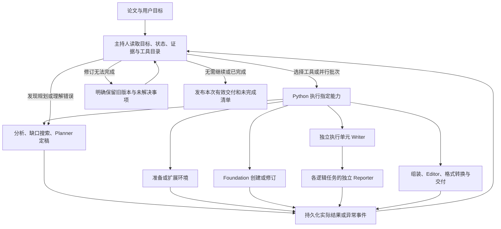

# 宿主自动交接与主持人异常协调

更新：2026-09-23。

## 现行运行边界

宿主按真实数据依赖推进分析、执行和报告阶段，并行派发互不冲突的 Writer 单元。专业节点完成后直接记录交付；运行中只能等待时直接等待。主持人不再为正常节点逐一批准，也不重复解释“工具仍在运行”。

Writer 的可读交付即使伴随宿主执行异常，也会携异常记录交给独立 Reporter。Reporter 使用从原论文重新准备的证据副本，独立判断科学结果及是否需要因果明确的重跑。宿主保留原始进程、配置、输入和产物记录，不把异常改写为科学失败，也不把未观察的运行写成成功。

当下一阶段确实无法执行、需要补充依赖或共享修订、修复归属不明，或报告无法交付时，主持人读取具体失败现场，决定交还原负责者、调用已注册的恢复能力或保留未完成状态。新增的 Writer 草稿文件只记为观察；原论文证据文件本身变化则明确记录并随交付交给 Reporter，不与 Foundation 版本错误混为一谈。

2026-09-22 的逐节点审批和全程主持人调度方案已被上述边界替代；下面保留其历史实施记录，不能作为现行流程说明。

## 2026-09-22 历史实施记录

## 目标与边界

主持人决定运行哪些能力、何时补查、如何分派修复、是否重试以及何时交付。Python 保存现场、执行工具、检查操作地址和资源冲突、认证真实执行证据。工具失败不自动等于整篇论文未复现。

本次按以下顺序改造：

1. 将现有角色与工程能力接入统一工具接口，提供输入说明、执行、状态查询、恢复适配器和写入资源声明。
2. 将项目调度、缺口补查、共享修订恢复和 Writer 批次选择交给主持人，删除对应的固定顺序/自动回退/固定额外一次重试分支。
3. 主程序保留参数与模型配置、工具接线、事件、真实执行、证据、资源和交付记录。专业角色继续负责科研内容。

## 当前接口与职责

- `supervisor_tools.py`：`SupervisorTool` 表达能力；`SupervisorTools.call/status/run` 执行、查询和调度。它不知道某个科学结果应当通过还是失败。
- `pipeline_supervision.py`：注册项目入口能力，并将工具结果接到下一层。主持人可以进入执行、生成已有结果的报告、交回 Planner 或重新澄清论文理解，也可以说明未完成事项后结束。
- `pipeline_execution_flow.py`：提供环境、Foundation、并行任务、保留旧共享版本、部分交付等能力。共享修订失败后，Python 不再规定只准额外修一次。
- `targeted_backfill_loop.py`：提供搜索、Planner 定稿、接收现有材料三个操作。搜索次数是显式资源预算；未知参数不会因为预算耗尽变成已知。搜索取得的新材料必须送到 Planner 后才有可接收的交接。
- `task_writer_dispatch.py`：把独立 execution unit 作为可并行启动的工具。strong 依赖仍保留在同一单元中。主持人选择批次；未派发单元单独记录，不能写成已执行。
- `supervisor.py`：保留专业节点的交接接收、原负责者修复和证据对账。节点操作也进入工具目录/状态账本；没有另一个自动调度器替主持人选下一阶段。
- Reporter 的原始结论保持独立。Writer 工具内部可按已授权职责交接给对应 Reporter；各任务的交接与澄清仍可并发，不持有全局模型锁。
- Editor 继续撰写两份中文报告。Python 负责格式转换与文件交付，不写替代性科学报告。删除了非主持人路径下 Editor 固定第二次重试的旧分支。

工具分为阶段组合能力和具体节点能力。解析、事实理解、规划等仍有真实的数据依赖；提供工具接口不意味着可以在没有论文或任务输入时执行下游实验，也不是允许任意执行 shell 或修改宿主源码。

主持人给搜索、Planner 和 Writer 的具体指令传递到原负责角色，进入相应提示词或交接输入身份；不能只记录“再次启动”而丢掉修复要求。Foundation 的修复仍保留原始共享组件范围和独立修订历史。

## 实际运行方式

可用工具由实际输入、已有版本和用户授权范围决定。是否选择可用工具、如何处理失败，以及是否停止新增工作，由主持人决定。资源冲突、文件归属和未执行事实不能由一句批准绕过。

## 唤醒与并发

工具完成、失败或交接会触发主持人判断。等待期间，执行器在本地等待工作完成；默认每 300 秒提供一次运行中检查机会，不在每次轮询时调用模型。嵌套控制器存在时由内层负责定期检查，外层等待结果，避免多层重复唤醒。

`start` 可以选择多个互不冲突的工具；`wait` 只能用于已有活跃工作；`finish` 可以明确放弃尚未启动的工作。主持人停止新增工作时，已有任务仍会被回收并保存结果；用户取消向下传播，不能被当作异常再启动修复。

工具线程继承统一模型配置、主持人上下文和实际智能体活动记录。工具批次和实际模型进程数分别记录。这里的写入资源约束防止共享目录/快照并发修改，不代表新增了 GPU 显存分配器；真实计算资源仍由现有执行层及任务环境负责。

并发审计从未派发状态开始，只在主持人实际选择批次后记录启动；不能预先把所有候选任务记成已并行运行。嵌套调度结束后重置外层定时检查基准，避免内外层在交接瞬间重复调用主持人。

本实现不是操作系统常驻服务。若整个宿主进程退出，需要重新启动 CLI/Web 工作进程再恢复；本次没有安装服务、自启动项或外部进程守护程序。

## 证据与恢复

- `audit/supervisor/tools/catalog.json`：本次发现的工具及输入说明。
- `audit/supervisor/tools/<地址哈希>/state.json`、`attempt_*.json`：最后状态与各次实际调用记录。
- `audit/supervisor/events/*.json`：派发、完成、失败、唤醒和决定事件。
- `audit/supervisor/processes/*.json`：本次拥有的模型进程、实际退出码与取消状态；用户停止会终止这些进程及其子进程，不只取消外层等待。
- `audit/supervisor/assignments/*.json`：跨重启保存的明确角色修订指令，绑定原始目标。
- 原有 `nodes/`、Moderator 证据快照、full 收据、版本和缓存校验继续保留。

运行中断的工具必须提供恢复适配器，先经原负责者的缓存/进程/收据机制对账。没有恢复接口时，不能因为换了输入或旧目录存在就重新启动未知副作用。阶段重试使用恢复模式，不沿用首次运行的清空选项。

首次环境准备遵守用户的全新/恢复选项，后续环境修复才强制保留已有状态。回归中还复现了 Windows 时间转换的一步浮点舍入差异：新文件的时间比开始时间小约 0.24 微秒，导致正常交付被当作旧文件。新鲜度比较统一容纳一步浮点差异，不增加秒级宽限；收据及源码、配置、输入和输出哈希核验保持不变。

环境扩展不会无条件重新生成 Foundation；新的环境交给 Writer 及执行证据绑定机制。环境哈希没有变化是观测，不自动判定整项目必须退出。放弃未成功的共享修订时，保留旧快照，移除该修订未成功引入的依赖请求，不污染后续独立任务。

共享修订异常携带本次任务记录；环境或修订失败仍能交付其他任务已完成的成果。旧版本、未执行结果、未完成组装、缺少的报告和独立 Reporter 的否定结论均不能冒充成功。

`GENG_SUPERVISOR_MAX_ACTIONS` 为每个工具调度会话的动作预算，默认 128；原有执行与模型范围预算继续生效。它们限制资源消耗，不解释科学结论。可用工具描述和失败现场始终提供给主持人，不按错误文案猜测修复归属。

## 已删除的冲突逻辑

- 单一就绪阶段由宿主直接推进的 `choose_next`。
- 根流程固定 `analysis → execution → reports` 的分支调度与额外宿主异常重试包装。
- Foundation 失败后的自动可选回退，以及共享修订固定一次恢复规则。
- 依赖请求重复或环境哈希不变时，宿主直接终止整个项目的分支。
- 依赖扩展后无条件重建 Foundation。
- Task Writer 固定一次启动全部单元的调度决定；现在批次来自主持人。
- Reporter/Editor 非主持人路径上的固定格式第二次重试。

保留解析依赖、科学任务合同、共享文件归属、真实退出码、取消、收据绑定、可信路径、状态锁和动作预算。它们描述输入是否存在、实际发生了什么以及能否执行一个具体动作，不判断论文是否成立。

## 验证

本次只使用已有本地 Python 和离线模拟角色，没有安装依赖、调用真实模型或重新复现论文。测试通过不能证明主持人的真实科研判断能力或端到端耗时已达标。

专项测试覆盖真实线程并发、失败后保留兄弟任务、主持人选择执行顺序/提前结束、中断先对账、未知副作用不盲重放、写入资源冲突、定时唤醒、取消传播、共享修订多次因果修复、保留旧版本和依赖隔离。相关新增测试使用模拟决定或模拟模型传输；原有专业角色测试明确隔离新调度模型。

组合测试通过真实 Moderator 协议与项目/执行调度器，替换实际科研角色，验证独立 Reporter 的 `not_reproduced` 可以正常进入报告交付。进程测试实际启动短小本地 Python 子进程，验证取消、退出码和已输出文本的保存；它们不启动 Codex 模型或论文计算。

验证结果（2026-09-22）：

- 全量离线回归：1094 passed、16 skipped、223 subtests passed；两条警告来自现有 Web 测试依赖的弃用提示。报告：`D:\geng-artifacts\reports\hd0922all4.xml`；日志：`D:\geng-artifacts\logs\hd0922all4.log`。
- 此后补齐搜索/Writer 指令传递，受影响路径复测：141 passed、1 skipped、10 subtests passed。报告：`D:\geng-artifacts\reports\hd0922t8.xml`；日志：`D:\geng-artifacts\logs\hd0922t8.log`。
- `git diff --check` 通过。测试输出、诊断现场与修改前快照均保留在固定的 `D:\geng-artifacts` 下。
