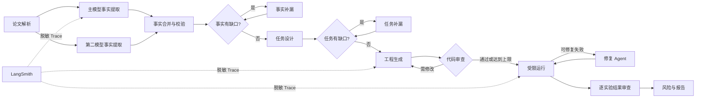

# LangChain / LangGraph / LangSmith Agent 协作改进实施计划

> **For implementation:** Use the `executing-plans` workflow to implement this plan task by task.

**目标：** 在不改变 case 产物格式、安全边界和 Web 基础设施的前提下，将现有手写 Agent 流水线渐进迁移为 LangChain 模型层、LangGraph 协作编排层和可选脱敏 LangSmith 观测层。

**架构：** LangChain 标准化模型、多模态输入和结构化输出；LangGraph 显式表达事实提取、任务设计、工程生成、审查、运行修复和结果审查之间的节点、分支、并行与循环；LangSmith 仅旁路记录脱敏轨迹。PostgreSQL、Redis、Celery 继续只服务网站和任务调度。

**技术栈：** Python 3.11、LangChain 1.x、LangGraph 1.x、LangSmith、Pydantic 2、现有 FastAPI/Celery。

---

## 1. 目标架构



架构边界保持不变：

- case 目录仍是论文、JSON、代码、图像和报告的产物真源。
- Graph State 只保存路径、状态、计数器和少量摘要。
- Schema、安全扫描、执行验收和最终风险结论继续由本地确定性代码完成。
- 第一版不启用 LangGraph Checkpoint，继续使用现有文件缓存和 `resume=True`。
- 不修改 PostgreSQL 表、Redis 用途或 Celery 队列协议。

## 2. 公共接口与配置

新增 CLI 参数：

```text
--orchestrator legacy|langgraph
```

优先级为 CLI 参数、`GENG_ORCHESTRATOR`、默认值。上线初期默认 `legacy`；通过等价性验收后改为 `langgraph`，并保留 legacy 一个发布周期。

新增 LangSmith 配置：

```text
GENG_LANGSMITH_ENABLED=false
LANGSMITH_API_KEY=
LANGSMITH_PROJECT=geng-agent
```

LangSmith 默认关闭。启用后只允许记录：

- 阶段名、匿名 case ID、模型名。
- 耗时、Token、重试次数。
- Schema 问题数量、补漏增量、审查问题数量。
- 运行状态、fallback 状态和评分。

禁止上传论文全文、Prompt 原文、模型完整输出、生成代码、stdout/stderr 和本地绝对路径。

现有 `ReviewPipeline.run()`、CLI 输出、Web 进度事件和 case 目录结构保持兼容。

## 3. 实施任务

### Task 1：建立架构契约与依赖

**文件：**

- Create: `docs/adr/0004-langgraph-agent-orchestration.md`
- Modify: `pyproject.toml`
- Modify: `geng_agent/preflight.py`
- Test: `tests/test_preflight.py`

步骤：

1. 先写依赖缺失、版本不兼容和 doctor 输出测试。
2. 加入兼容的 LangChain、LangGraph、LangSmith 及 OpenAI 适配依赖。
3. ADR 明确产物真源、无 Checkpoint、渐进迁移和 Web 边界。
4. 运行 `python -m unittest tests.test_preflight -v`。
5. 提交：`docs: define langgraph orchestration architecture`。

### Task 2：引入 LangChain 模型适配器

**文件：**

- Create: `geng_agent/langchain_runtime.py`
- Modify: `geng_agent/config.py`
- Modify: `geng_agent/llm.py`
- Test: `tests/test_langchain_runtime.py`
- Test: `tests/test_multimodal_extraction.py`

实现要求：

- `LangChainLLMClient` 继续实现现有 `LLMClient.complete()` 和 `complete_multimodal()` 协议。
- 使用现有 Pydantic 模型完成结构化输出，不建立第二套 Schema。
- 保留 `usage_log` 字段，确保 `run_cost.json` 格式不变。
- 支持主模型、异构 Reviewer 和第二多模态提取模型。
- Provider 不支持严格 Schema 时保留 JSON object 降级行为。

验收命令：

```powershell
python -m unittest tests.test_langchain_runtime tests.test_multimodal_extraction tests.test_run_cost_and_determinism -v
```

提交：`feat: add langchain model adapter`。

### Task 3：建立脱敏 Tracing 抽象

**文件：**

- Create: `geng_agent/tracing.py`
- Modify: `geng_agent/config.py`
- Modify: `.env.example`
- Test: `tests/test_tracing.py`

实现要求：

- 定义 `TraceSink` 协议、`NullTraceSink` 和 `LangSmithTraceSink`。
- LangSmith 不可用、超时或配置错误不得中断复现流程。
- 对属性实行白名单，不采用“先记录再删除”的策略。
- case ID 使用稳定哈希；路径只保留相对阶段标签。
- Trace 覆盖模型调用、Graph 节点、修复轮次和结果评分。

验收命令：

```powershell
python -m unittest tests.test_tracing -v
```

提交：`feat: add optional redacted langsmith tracing`。

### Task 4：建立 LangGraph 状态与兼容骨架

**文件：**

- Create: `geng_agent/agent_graph/state.py`
- Create: `geng_agent/agent_graph/nodes.py`
- Create: `geng_agent/agent_graph/workflow.py`
- Create: `geng_agent/agent_graph/__init__.py`
- Test: `tests/test_agent_graph_state.py`
- Test: `tests/test_agent_graph_routing.py`

`AgentGraphState` 至少包含：

```text
paper_path、output_dir、options
facts_path、tasks_path、experiment_index_path
manifest_path、runtime_result_path、result_review_path
fact_gap_round、task_gap_round、code_review_round、repair_round
validation_errors、last_error、fallback_used、completed_steps
```

要求：

- State 保持可序列化，不保存 PDF 字节、图片 Base64 和完整代码。
- 节点初期调用现有 `ReviewPipeline` 阶段方法，避免一次性重写业务逻辑。
- 复用现有 `ProgressReporter`，节点开始和结束仍产生五阶段事件。
- 取消检查发生在每个昂贵节点边界。

提交：`feat: add langgraph orchestration skeleton`。

### Task 5：迁移论文解构与任务设计子图

**文件：**

- Modify: `geng_agent/agent_graph/nodes.py`
- Modify: `geng_agent/agent_graph/workflow.py`
- Modify: `geng_agent/pipeline.py`
- Test: `tests/test_agent_graph_analysis.py`
- Test: `tests/test_facts_coverage.py`
- Test: `tests/test_ensemble.py`

图行为：

1. 解析论文。
2. 主、次模型使用独立输出路径并行提取事实。
3. 单一合并节点写入正式 `engineering_facts.json`。
4. 确定性覆盖检查决定结束或进入事实补漏循环。
5. 任务生成后执行任务覆盖检查和补漏循环。
6. 本地构建 `experiment_index.json`。

限制：

- 并行节点不得同时写正式 facts 文件。
- 第二模型失败只记录风险，不使主模型结果失败。
- 补漏轮数和停止条件与现有实现一致。

提交：`feat: migrate analysis stages to langgraph`。

### Task 6：迁移工程生成与代码审查子图

**文件：**

- Modify: `geng_agent/agent_graph/nodes.py`
- Modify: `geng_agent/agent_graph/workflow.py`
- Modify: `geng_agent/code_review.py`
- Test: `tests/test_agent_graph_project_build.py`
- Test: `tests/test_code_review.py`
- Test: `tests/test_task_layout_pipeline.py`

图行为：

- 先生成共享科学模块和工程计划。
- per-task 模式下动态派生任务脚本 Worker。
- Worker 只生成自己的任务文件，不修改共享模块。
- 聚合节点执行 manifest、路径、AST 和编译校验。
- Reviewer 发现 blocking 问题时返回生成节点。
- 达到上限时保留“阻断问题最少且可编译”的最佳版本。
- 模板 fallback 继续由本地代码决定和标记。

提交：`feat: migrate project generation and review graph`。

### Task 7：迁移运行、修复和结果审查子图

**文件：**

- Modify: `geng_agent/agent_graph/nodes.py`
- Modify: `geng_agent/agent_graph/workflow.py`
- Modify: `geng_agent/runner.py`
- Modify: `geng_agent/result_review.py`
- Test: `tests/test_agent_graph_execution.py`
- Test: `tests/test_runner.py`
- Test: `tests/test_result_review_pertask.py`

图行为：

- 安全扫描通过后才允许执行。
- 运行失败时，根据后端进入 LLM RepairManifest 或 OpenHands 修复节点。
- 每次修复后重新经过安全、依赖、编译和产物验收。
- 修复达到上限后进入失败或部分成功路径。
- 结果审查按实验并行，最后由确定性聚合节点生成总评。
- 单实验失败不得阻断其他实验审查。

提交：`feat: migrate execution repair and result review graph`。

### Task 8：接入 CLI 和 Web 并完成切换

**文件：**

- Modify: `geng_agent/cli.py`
- Modify: `geng_agent/web/tasks.py`
- Modify: `geng_agent/web/pipeline_runner.py`
- Modify: `geng_agent/web/settings.py`
- Test: `tests/test_orchestrator_parity.py`
- Test: `tests/test_progress_events.py`
- Test: `tests/test_web_stages.py`

要求：

- legacy 和 langgraph 使用相同运行参数和 `PipelineResult`。
- Web 只选择编排器，不感知 Graph 内部节点。
- PostgreSQL、Redis、Celery 模型及协议不变。
- 两种编排器使用同一 Fake LLM 运行固定 fixture，核心 JSON、状态和报告判定必须等价。
- 等价性通过后将默认编排器切换为 langgraph。

提交：`feat: make langgraph the default orchestrator`。

### Task 9：全量回归、Benchmark 和文档

**文件：**

- Modify: `README.md`
- Modify: `docs/web_configuration.md`
- Modify: `docs/benchmark.md`
- Test: `tests/test_orchestrator_parity.py`

验收命令：

```powershell
python -m unittest discover -s tests -v
python -m geng_agent benchmark benchmarks/communication_v1/suite.json --validate-only
python -m geng_agent doctor
```

固定案例对比 legacy 与 langgraph：

- `engineering_facts.json` 和 `repro_tasks.json` 均通过现有 Schema。
- 实验覆盖率不得下降。
- 安全检查和编译通过率不得下降。
- fallback 率不得上升。
- 相同模型配置下 Token 增加不超过 10%。
- Graph 模式支持现有 `resume`、取消和五阶段进度事件。
- LangSmith 关闭时不产生外部网络调用。
- LangSmith 故障时复现任务仍能完成。

提交：`docs: document langgraph orchestration and observability`。

## 4. 测试场景

必须覆盖：

- 单模型与双模型事实提取。
- 第二模型超时或返回非法结构。
- Facts 和 Tasks 多轮补漏及达到上限。
- 代码审查通过、返修、返修退化和最佳版本恢复。
- smoke/full 运行、部分成功、修复耗尽和模板 fallback。
- per-task 独立执行与逐实验结果审查。
- Graph 节点异常、取消和重新运行。
- legacy/langgraph 产物契约等价。
- LangSmith 关闭、脱敏、超时和认证失败。
- Prompt、论文、代码和日志不进入 Trace 属性。

## 5. 假设与既定决策

- 采用渐进式迁移，不一次性重写 `ReviewPipeline`。
- LangSmith 默认关闭，启用时采用字段白名单脱敏。
- 第一版不启用 LangGraph 持久化和 Human-in-the-loop。
- case 目录仍是 Agent 协作产物真源。
- PostgreSQL 和 Redis 仍只属于网站支撑层。
- 不改变现有 JSON Schema、CLI 默认安全策略和生成代码执行边界。
- LangGraph 的价值以复现质量、恢复能力和可维护性衡量，而不是以 Agent 数量衡量。
